# PlugScout Architecture

## Visual overview



Regenerate SVG from Mermaid source:
```bash
npx -y @mermaid-js/mermaid-cli -i assets/visual-architecture.mmd -o assets/visual-architecture.svg -b transparent
```

---

## Data flow

```
config/registries.json
        │
        ▼
  catalog/adapter.ts          dispatches by registry.adapter field
        │
        ▼
  catalog/adapters/*.ts       normalizes raw entries → CatalogItem[]
        │
        ▼
  catalog/sync.ts             merges + deduplicates → writes ~/.plugscout/data/catalog/items.json
        │
        ▼
  catalog/repository.ts       loadCatalogItems() reads the cached JSON
        │
   ┌────┴──────────────────┐
   ▼                       ▼
recommendation/        security/
engine.ts              assessment.ts
rankCandidate()        buildAssessment()
   │                       │
   └────────┬──────────────┘
            ▼
     Recommendation[]  (returned by recommend())
            │
            ▼
   interfaces/cli/index.ts   formats + prints table or JSON
```

---

## Scoring model

### Trust score (0–100)
Computed from three catalog signals, weighted by `config/ranking-policy.json`:

```
trustScore = maintenanceSignal × (weights.maintenance / 100)
           + provenanceSignal  × (weights.provenance  / 100)
           + adoptionSignal    × (weights.adoption    / 100)
```

- `maintenanceSignal` — recent commits, active maintainers
- `provenanceSignal` — official source, signed releases
- `adoptionSignal` — download counts, stars, forks

### Risk score (0–100)
Weighted sum of security signal counts from `securitySignals` on each `CatalogItem`:

```
riskScore = knownVulnerabilities × scoring.vulnerabilityWeight
          + suspiciousPatterns   × scoring.suspiciousWeight
          + injectionFindings    × scoring.injectionWeight
          + exfiltrationSignals  × scoring.exfiltrationWeight
          + integrityAlerts      × scoring.integrityWeight
```
Capped at 100. Thresholds from `config/security-policy.json`:
- `low` — 0 to `thresholds.lowMax`
- `medium` — lowMax+1 to `thresholds.mediumMax`
- `high` — mediumMax+1 to `thresholds.highMax`
- `critical` — highMax+1 to 100

Install gate blocks `high` and `critical` by default.

### Fit score (0–100)
Measures how well a candidate's capabilities and compatibility tags match the scanned project:

```
compatibilityScore = overlapScore(candidate.compatibility, projectTags + requirements.stack)
capabilityScore    = overlapScore(candidate.capabilities,  inferredCapabilities + requiredCapabilities)
fitScore           = compatibilityScore × weights.compatibilityFit
                   + capabilityScore    × weights.capabilityFit
                   + inferredMatches    × weights.inferredCapabilityBoost
```

### Rank score (0–100, clamped)
```
sourcePenalty  = (source !== 'official') ? weights.unofficialSourcePenalty : 0
securityPenalty = min(100, (riskScore/100) × weights.securityPenaltyMax + sourcePenalty)
blockedPenalty  = blocked ? weights.blockedPenalty : 0
freshnessBonus  = (freshnessSignal/100) × weights.freshnessBonus Max

rankScore = clamp(fitScore + trustScore + freshnessBonus - securityPenalty - blockedPenalty, 0, 100)
```

Results are sorted by `rankScore` descending, tie-broken by `trustScore`.

---

## Catalog kinds

| Kind | Description |
|---|---|
| `skill` | Claude Skills — prompt-based task definitions |
| `mcp` | MCP servers — tools exposed via Model Context Protocol |
| `claude-plugin` | Claude Desktop plugins |
| `claude-connector` | Claude connector integrations |
| `copilot-extension` | GitHub Copilot extensions |
| `cursor-extension` | Cursor IDE extensions |
| `gemini-extension` | Gemini CLI MCP servers |

`CatalogKind` is an exhaustive TypeScript enum. `Record<CatalogKind, T>` appears in several places and must list all 7 kinds. See `AGENTS.md` for the full checklist when adding a new kind.

---

## Registry + adapter pattern

Each entry in `config/registries.json` specifies an `adapter` field that maps to a handler in `src/catalog/adapter.ts`. The adapter normalizes raw source data (JSON arrays, YAML, GitHub API responses) into `CatalogItem[]` validated against `CatalogItemSchema` from `contracts.ts`.

```
registries.json
  { "id": "public-mcp-directory", "adapter": "mcp-v1", "entries": [...] }
                │
                ▼
  adapter.ts:  if (registry.adapter === 'mcp-v1') → adaptMcpEntries(...)
                │
                ▼
  adapters/mcp-v1.ts:  returns CatalogItem[]
```

Remote registries (those with a `remote` field) are fetched during `sync`. Inline `entries` are always available as fallback.

---

## Security model

Security signals are attached to each `CatalogItem.securitySignals`. They are populated at sync time from static analysis data embedded in registry entries. The `buildAssessment()` function in `src/security/assessment.ts` translates signals into a `RiskAssessment` with a numeric score and tier label.

The install gate reads `config/security-policy.json`. By default it blocks `high` and `critical` items. `--override-risk` bypasses the gate with an audit log entry.

Whitelist entries (manually approved items) are stored in `~/.plugscout/data/whitelist/`. Quarantined items are in `~/.plugscout/data/quarantine/`. Both are checked at install time and in `plugscout doctor`.

---

## Web report

`plugscout web [--open]` writes a self-contained static HTML file (default: `.plugscout/report.html`). The file includes all cards, CSS, and JavaScript inline — no external dependencies.

Key constraints:
- The `--limit` option controls how many cards are rendered, **not** what the stat cards count. Stat cards always reflect the full pre-limit catalog.
- Filter, sort, and search are implemented client-side in inline JavaScript.
- Stat kind cards are clickable to filter by that kind.

---

## Related docs

- CLI commands: [`cli-reference.md`](cli-reference.md)
- Security model: [`security/README.md`](security/README.md)
- CI workflows: [`ci/`](ci/)
- Contribution guide: [`../AGENTS.md`](../AGENTS.md)
- Claude Code guide: [`../CLAUDE.md`](../CLAUDE.md)
